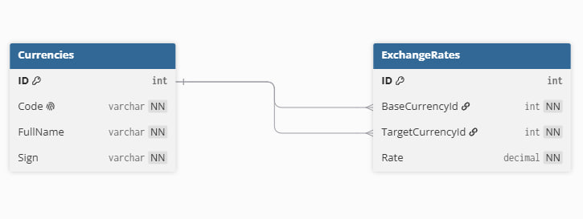
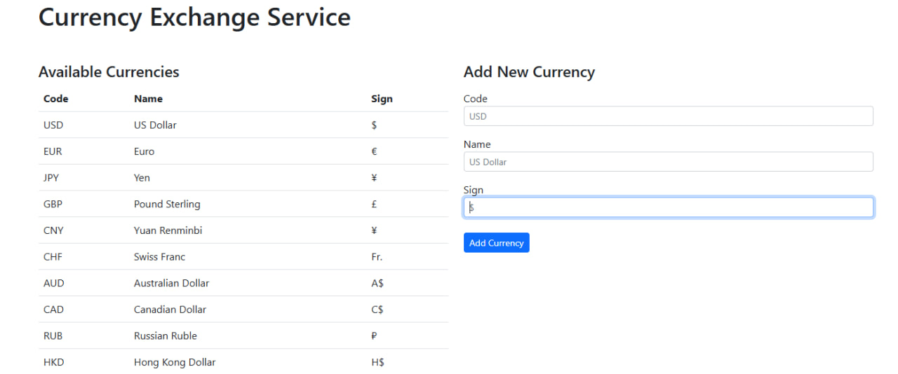
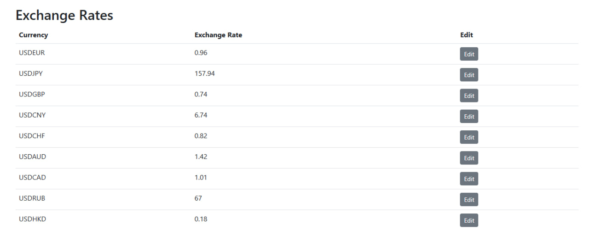
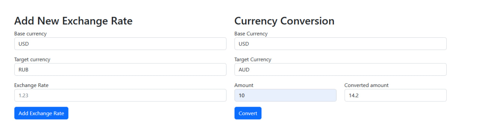

# **Проект “Обмен валют”**

## Описание проекта
REST API для описания валют и обменных курсов. Позволяет просматривать и редактировать списки валют и обменных курсов, и совершать расчёт конвертации произвольных сумм из одной валюты в другую. Приложение доступно по адресу: https://currencyexchanger.duckdns.org/.

Подробное техническое задание доступно по ссылке:  
[ТЗ проекта](https://zhukovsd.github.io/java-backend-learning-course/projects/currency-exchange/)

---

Приложение написано на языке C# в ООП-стиле с использованием:

*   **ASP.NET Core WebApi**
*   **REST API**
*   **SQLite**
*   **Docker**
*   **Deploy in VPS (Ubuntu 24.04)**

---

## База данных:
### Таблица `Currencies`
| Колонка | Тип | Комментарий |
|-----|----------|--------|
| ID | int | Первичный ключ, айди |
| Code | Varchar | Код валюты |
| FullName | Varchar |	Полное имя валюты |
| Sign | Varchar | Символ валюты |

#### Пример записи в таблице для австралийского доллара:
| ID | Code | FullName | Sign | 
|-----|----------|--------|-----|
| 1 | AUD | Australian dollar| A$|

### Таблица `ExchangeRates`
| Колонка | Тип | Комментарий |
|-----|----------|--------|
| ID | int | Айди курса обмена, первичный ключ |
| BaseCurrencyId | int | ID базовой валюты, `внешний ключ на Currencies.ID` |
| TargetCurrencyId | int | ID целевой валюты, `внешний ключ на Currencies.ID` |
| Rate | Decimal(6) | Курс обмена единицы базовой валюты к единице целевой валюты |

#### Пример записи в таблице для пары доллар-евро:
| ID  | BaseCurrencyId | TargetCurrencyId | Rate |
|-----|----------|--------|------|
| 1 | 1 | 2 |0.96|

---

## Реализованные запросы:
* **GET-запросы**
  * `/currencies` - Получение списка валют
  * `/currency/EUR` - Получение конкретной валюты
  * `/exchangeRates` - Получение списка всех обменных курсов
  * `/exchangeRate/USDRUB` - Получение конкретного обменного курса
  * `/exchange?from=USD&to=RUB&amount=20` - Расчёт перевода определённого количества средств из одной валюты в другую
* **POST-запросы**
  * `/currencies?name=US Dollar&code=USD&sign=$` - Добавление новой валюты в базу
  * `/exchangeRates?baseCurrencyCode=USD&targetCurrencyCode=RUB&rate=67` - Добавление нового обменного курса в базу
* **PATCH-запросы**
  * `/exchangeRate/USDRUB?rate=52` - Обновление существующего в базе обменного курса
---
## Схема базы данных

---
## Скриншоты приложения

  

